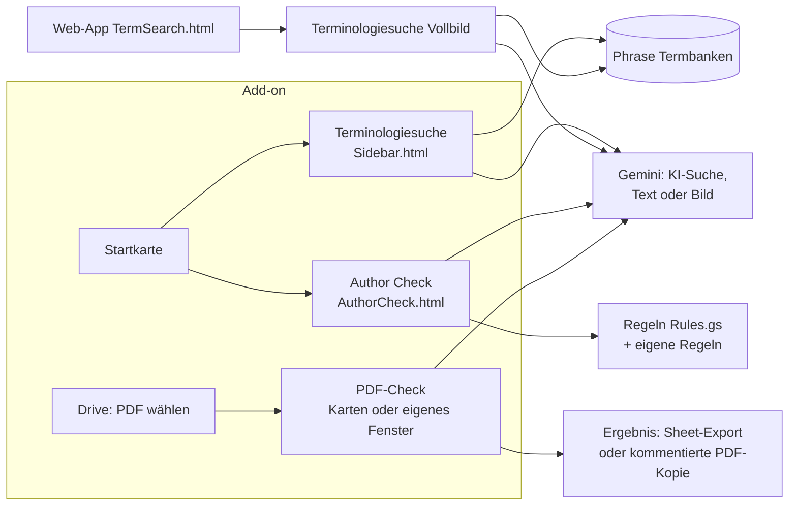

# Kärcher TermCheck (Repo `term-author-checker`)

> Kurz: Google-Workspace-Add-on (Docs, Sheets, Slides, Drive) und Web-App mit zwei Werkzeugen: 🔍 **Terminologiesuche** in den Phrase-Termbanken (mit KI-gestützter Freitext- und Bildsuche) und ✍️ **Author Check** – Grammatik-, Terminologie- und Stilprüfung mit Gemini nach einstellbaren Regeln, auch für **PDFs in Google Drive**. Oberfläche in 15 Sprachen.

---

## 1. Steckbrief

| Eigenschaft | Wert |
|---|---|
| Typ | Workspace-Add-on „Kärcher TermCheck“ (Farbe `#FFED00`/`#3A3A3A`) + Web-App (`executeAs: USER_ACCESSING`, `access: DOMAIN`) |
| Einstiege | `onHomepage` (Docs/Sheets/Slides: Wahl Terminologiesuche oder Author Check), `onDriveHomepage`, `onDriveItemsSelected` (PDF), Web-App `doGet` → `src/TermSearch.html`; `?page=pdfcheck` → PDF-Prüffenster |
| Phrase | `PHRASE_API_TOKEN`, API v1 (Termbanken, Projektvorlagen) |
| Gemini | `GEMINI_API_URL` (Standard Proxy `https://34-111-99-134.nip.io/gemini/v1beta/models/`), `AI_MODEL` (`gemini-3.6-flash`), `AI_TEMPERATURE` (0.2), Retry bei 429/5xx |
| Datenbank | optional „Custom Rules Log“-Sheet (`CUSTOM_RULES_LOG_SHEET_ID`, Tab `Custom`); Nutzerregeln in User Properties + JSON-Datei in Drive |
| Erweiterte Dienste | Drive v3, Sheets v4 |
| Rollen | `ADMIN` (in `ADMIN_EMAILS`), sonst `GUEST`; leere Admin-Liste → niemand ist Admin |
| CI/CD | `ci.yml` (statische Prüfung, Gem-Dateien, Gesamtdokument-Prompts End-to-End, UI-Tests im Browser, optional Live-Check mit Gemini; lokal `node tests/run-all.js`), `deploy.yml` (erst `ci.yml`, dann `main` → `clasp push` + Version; Secrets `CLASPRC_JSON`, `SCRIPT_ID`, `DEPLOYMENT_ID`) |

## 2. Aufbau



## 3. Terminologiesuche

- Durchsucht die erlaubten Termbanken (`ALLOWED_TB_UIDS`, leer = alle) in Phrase, zeigt Benennungen je Sprache mit Flaggen.
- **KI-Suche:** Freitext oder Bild → Gemini schlägt 1–3 Fachbegriffe vor (Prompt `AI_PROMPT`), dann Termbank-Suche.
- **Browse:** Termbank seitenweise durchblättern, sortieren, filtern; Export ins Sheet.
- Sprachen der Suche aus den Projektvorlagen `TEMPLATE_LLM` (`pNoERiZ1YTileyUe4Za1j6`, „[AKW] Terminology check [MT+Review LLM]“) und `TEMPLATE_ALG` (`arpmvYCEAqGl0OmKV9f3s3`, „[AKW] Terminology check [MT+Review ALG]“).
- Teilbare Links: Web-App-URL + `?q=<suchbegriff>`.

## 4. Author Check

- Prüft das ganze Dokument oder nur die Auswahl (Docs, Sheets, Slides), max. 60.000 Zeichen, bis 5 parallele KI-Anfragen.
- Prompt: `AUTHORCHECK_PROMPT` (Admin-pflegbar) mit Glossar aus der Termbank, aktiven Standardregeln und eigenen Regeln (`SPECIFIC CHECK`).
- Ergebnisse: Fehlerliste mit Vorschlag; **Ersetzen**, **Zur Stelle springen**, **als Kommentar einfügen**; Export als Audit-Report oder Regelübersicht.
- **Regeln:** Standardregeln für Deutsch und Englisch (`src/Rules.gs`, Typen Grammar, Spelling, Style, Terminology …), je Nutzer ein-/ausschaltbar mit Parametern. Nur Abweichungen werden gespeichert (User Properties, gestückelt). Eigene Regeln (`CUSTOM_…`) liegen in einer JSON-Datei im Drive des Nutzers; neue eigene Regeln werden ins Custom-Rules-Log geschrieben.
- **JSON-Import/-Export** von Regelsätzen; „Standard wiederherstellen“.
- **Zwei Gemini-Gems** (Buttons 🤖 im Regel-Popup):
  - „Regel mit Gemini vorbereiten“: `https://gemini.google.com/gem/1U9keOE3XPTPG3QEq63ZCYZ-5EOTruqgC`
  - „Kärcher Regel-Importer“ (Leitfaden-PDF → JSON): `https://gemini.google.com/gem/1bgoe1LSjDPZMId5lf98dBbVQp1KMH2CO` – Einrichtung und Anweisungen in `gemini-gem/` (`gem-anweisungen.md`, Wissen `standardregeln_de.md`, `standardregeln_en.md`, Beispiel `beispiel_RL2026_de.json`).

## 5. PDF-Prüfung in Drive

- PDF in Drive markieren → Seitenbereich → „PDF prüfen“ mit Sprachwahl (31 Sprachen).
- Ablauf in Etappen: PDF laden (≤ 15 MB direkt; bis 300 MB wird es vorher ohne große Bilder neu aufgebaut, `src/PdfShrink.gs`), Text mit Positionen extrahieren (`src/PdfTextPosition.gs`, `src/PdfInflate.gs`), Gemini prüfen, Ergebnis.
- Ausgabe: Ergebnis-Karte (max. 25 Befunde), **Export ins Sheet** oder **kommentierte PDF-Kopie** (Anmerkungen an den Fundstellen, `src/PdfAnnotate.gs`; große Dateien stückweise hochgeladen).
- **Eigenes Fenster:** Mit gesetzter Script Property `WEBAPP_URL` (…/exec einer Web-App-Bereitstellung, „Ausführen als Nutzer“, Zugriff Domain) öffnet „PDF prüfen“ das Fenster `src/PdfCheck.html`, das alle Etappen automatisch abarbeitet (6 min statt 30 s pro Aufruf). Prüfen mit `checkPdfWindowSetup()`.

## 6. Script Properties (Admin-Einstellungen)

| Property | Zweck |
|---|---|
| `PHRASE_API_TOKEN` | Phrase |
| `ADMIN_EMAILS` | Admins |
| `TEMPLATE_LLM`, `TEMPLATE_ALG` | Projektvorlagen für Sprachen |
| `ALLOWED_TB_UIDS` | erlaubte Termbanken |
| `CUSTOM_RULES_LOG_SHEET_ID` | Log neuer eigener Regeln |
| `GEMINI_API_KEY`, `GEMINI_API_URL`, `AI_MODEL`, `AI_TEMPERATURE` | KI |
| `AI_PROMPT` | Prompt der KI-Suche |
| `AUTHORCHECK_PROMPT` | Prompt des Author Check |
| `WEBAPP_URL` | PDF-Fenster |
| `DOC_PROMPT_PDF_MAX_MB` | optional: größte PDF (MB), die einem Gesamtdokument-Prompt direkt beiliegt (Standard 13); größere laufen über den Seitentext |
| `EXPORT_FOLDER_ID` | Ziel für `exportProjectToTxt` (Quellcode-Export) |

User Properties: `UI_LANG` (15 Sprachen: en, de, fr, es, it, pt, zh, ja, no, sv, fi, tr, hu, hr, el), `AUTHORCHECK_RULES_HELP_SEEN`, `DRIVE_PDF_LAST_LANGUAGE`, Regel-Overrides.

## 7. Phrase-Workflows (Ordner `workflows/`)

Exporte von **Phrase-Orchestrator**-Workflows „Brand Review Assignment“ (v6 Schritt 2, v6 Schritt 3, v7 Schritt 2+3): lesen die Custom Fields eines Projekts und weisen je nach Review-Schlüssel eine Vorlage pro Workflow-Schritt zu. Die Zuordnung steht in `mapping-value.txt`, z. B. `reviewakw` → Schritt 2 → Vorlage `fEp3QVEveabMf91OcwP418`, `reviewkft` → `89QZMp1Zd4TrgOPVjLBCC2`, Campus-DSGVO-/Produkt-/Sales-Trainings je Schritt 2 und 3. Dazu eine Postman-Collection „Phrase TMS - Project Templates“.

## 8. Dateien

| Datei | Inhalt |
|---|---|
| `src/Code.gs` | Web-App, Kontext, Einstellungen, Termbanken, Suche, KI-Suche, Sheet-Export, Sidebar |
| `src/Authorcheck.gs`, `src/AuthorCheck.html` | Author Check |
| `src/Rules.gs` | Standardregeln DE/EN, Regel-API, Custom-Rules-Log |
| `src/DriveAddon.gs`, `src/DrivePdfPrep.gs`, `src/DrivePdfWeb.gs`, `src/PdfCheck.html` | PDF-Prüfung |
| `src/PdfAnnotate.gs`, `src/PdfInflate.gs`, `src/PdfShrink.gs`, `src/PdfTextPosition.gs` | PDF-Verarbeitung ohne externe Bibliotheken |
| `src/Homepage.gs`, `src/HomeChooser.html`, `src/Sidebar.html`, `src/TermSearch.html` | Oberflächen |
| `src/I18n.html`, `src/CardI18n.gs` | Texte in 15 Sprachen |
| `src/GeminiTest.gs` | `apiDebugGeminiConnection` |
| `src/exportProjectToTxt.gs` | Quellcode als Text exportieren |
| `tests/` | Syntax- und Aufrufprüfung, UI-Smoke |
| `gemini-gem/` | Gem „Kärcher Regel-Importer“ |
| `workflows/` | Phrase-Orchestrator-Workflows |

---

Gesamtdokumentation aller zehn Repositories (Systemlandkarte, alle Endpunkte, Datenbanken, FAQ): [`MMario996/kaerchertranslationservices` → `docs/gesamt/`](https://github.com/MMario996/kaerchertranslationservices/tree/main/docs/gesamt).

---

## Standard-Anhang (in allen Repositories gleich aufgebaut)

### A. Repository-Struktur

```
term-author-checker/
├── src/                  Apps-Script-Code (clasp rootDir) inkl. appsscript.json
├── gemini-gem/           Gemini-Gem-Anweisungen und Beispiel-JSONs
├── workflows/            Phrase-Orchestrator-Workflows
├── tests/                Node-Tests (npm test), u. a. gas.syntax.test.js (Standard)
├── tools/                check-structure.js (Standard), check-encoding.js, Build-Skripte
├── docs/                 DOKUMENTATION.md, ENDPOINTS.md, CI-CD.md
├── .github/              workflows/ci.yml, workflows/deploy.yml, actions/clasp-deploy/,
│                         dependabot.yml, CODEOWNERS, pull_request_template.md
├── .claspignore, .gitignore, .gitleaks.toml, eslint.config.js, package.json
└── README.md
```

Einheitliche Befehle: `npm ci`, `npm test`, `npm run lint`, `npm run check` (Struktur, Kodierung, generierte Dateien), `npm run ci` (alles).

### B. Schnittstellen

- **Phrase TMS:** 3 Endpunkt-Aufrufe, Token PHRASE_API_TOKEN (Präfix `ApiToken`/`Bearer` wird entfernt).
- **Weitere Dienste:** Gemini (Apigee-Proxy), Google Drive REST, Apps Script API, Google Sheets, MailApp, Gemini Gems.
- Vollständig mit Methode, Version, Zweck und Datei: [`docs/ENDPOINTS.md`](ENDPOINTS.md). Alle Anwendungen im Vergleich: [`ENDPOINTS-GESAMT.md`](https://github.com/MMario996/kaerchertranslationservices/blob/main/docs/gesamt/ENDPOINTS-GESAMT.md).

### C. Zusammenhänge mit anderen Anwendungen

| Partner | Richtung | Was |
|---|---|---|
| Phrase TMS | ← | Termbanken lesen und durchsuchen, Sprachen aus Projektvorlagen |
| Gemini | → | KI-Suche, Author Check, PDF-Prüfung |
| Terminology Hub | fachlich | gleiche Termbanken; der Hub pflegt, TermCheck nutzt sie |
| Phrase Orchestrator | Dateien | Workflow-Definitionen in `workflows/` (Brand Review) |

Systemlandkarte aller zehn Anwendungen: [`systemlandkarte.svg`](https://github.com/MMario996/kaerchertranslationservices/blob/main/docs/gesamt/systemlandkarte.svg), Gesamtübersicht: [`00-GESAMTUEBERSICHT.md`](https://github.com/MMario996/kaerchertranslationservices/blob/main/docs/gesamt/00-GESAMTUEBERSICHT.md).

### D. Entwicklung, Tests, Deployment

CI `ci.yml` (statisch, Standard-Test, Struktur, Gem-Dateien, End-to-End, UI, optional Live-Check); CD `deploy.yml`: `main` → `clasp push` + Version, Secrets `CLASPRC_JSON`, `SCRIPT_ID`, `DEPLOYMENT_ID`. Details: [`docs/CI-CD.md`](CI-CD.md).

> **clasp:** `clasp push` ersetzt den kompletten Code im Apps-Script-Projekt. Was nur im Online-Editor geändert wurde, geht verloren. Der Code liegt seit Oktober 2026 unter `src/` (`.clasp.json` mit `"rootDir": "src"`).

### E. Auffälligkeiten (Stand 2026-10-02)

- `ci/` heißt jetzt `tests/` (gleicher Inhalt); lokale Aufrufe `node tests/run-all.js`.
- `src/PdfTextPosition.gs` enthält absichtlich Ersatzzeichen (`�`) in Zeichentabellen; erfasst in `tools/encoding-baseline.json`.
